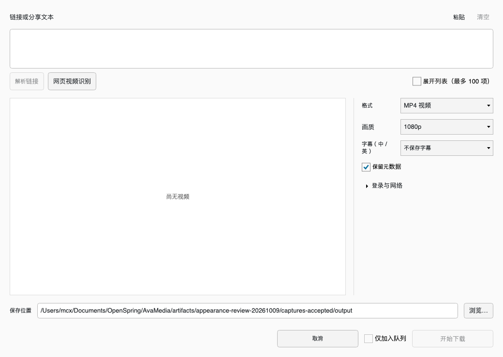

# AvaMedia

[简体中文](README.md) · **English**

[](https://github.com/mcxen/AvaMedia/actions/workflows/ci.yml)
[](https://github.com/mcxen/AvaMedia/actions/workflows/release.yml)
[](LICENSE)

An open-source desktop media toolkit for **Windows and macOS**. Convert, compress, edit, play and download media, work with images and PDFs, and manage batch operations in one task queue.

Built with **C#, .NET 8 and Avalonia 11**, with Simplified Chinese / English interfaces and Light, Dark and Mac OS 9 · Platinum skins. AvaMedia is under active development; see the [feature notes](docs/FEATURES.md) for implementation and verification status.

[Download](https://github.com/mcxen/AvaMedia/releases/latest) · [Screenshots](#screenshots) · [Run from source](#run-from-source) · [Report an issue](https://github.com/mcxen/AvaMedia/issues)

## Download and installation

Download the package for your platform from [GitHub Releases](https://github.com/mcxen/AvaMedia/releases/latest).

| Platform | File | Installation |
| --- | --- | --- |
| Windows x64 | `AvaMedia-<version>-win-x64-setup.exe` | Run the installer; includes shortcuts and an uninstaller |
| Windows x64 portable | `AvaMedia-<version>-win-x64-portable.zip` | Extract and run `AvaMedia.Desktop.exe` |
| macOS Apple Silicon | `AvaMedia-<version>-osx-arm64.dmg` | Open the DMG and drag `天池万象转换.app` into Applications |

The macOS package targets **Apple Silicon (ARM64) and declares macOS 13.4 as its minimum version**. See the [platform notes](docs/PLATFORMS.md) for device verification status at that minimum version. The app uses ad-hoc signing and has not been Developer ID signed or notarized; you may need to allow it in System Settings → Privacy & Security on first launch.

New builds include **FFmpeg / FFprobe, yt-dlp and QuickJS-NG**. If .NET 8 is missing, the first-launch window offers an “Install runtime” button (shown in Chinese). It downloads and verifies the required .NET and ASP.NET Core runtimes into the current user's directory, then opens the app automatically. A complete existing runtime is reused. Once configured, the runtime location is saved and subsequent launches load it directly without a separate preflight check. No administrator privileges, SDK or Python installation is required. Release notes include SHA256 checksums and links to the corresponding media-tool source archives. The installed app's Chinese name is “天池万象转换”; repository and package names remain AvaMedia.

Current development builds download and verify the LaMa model in the background on the first normal launch. Other tools remain available, and a valid cached model is not downloaded again. LaMa restoration inference and its editor entry point are not yet integrated; see the [model installation notes](docs/MODEL-INSTALLATION.md).

## Features

| Feature | Capabilities |
| --- | --- |
| Video conversion and compression | MP4, MKV, WebM, AVI, MOV, TS and more; quality, bitrate or target size; Apple, NVIDIA, Intel and AMD hardware transcoding with software fallback; iPhone HDR to SDR |
| Editing and batch tools | Multiple files and clips; split by count, duration or timestamps; crop, rotate, mirror, speed and fades; batch cropping, orientation suggestions, renaming and contact sheets |
| Audio tracks and subtitles | Join, mux and extract streams; track selection, multiple audio tracks, sample rate, channels, volume and audio effects; burned-in or separate subtitle tracks |
| Image conversion and compression | HEIC / HEIF input; JPEG, WebP and PNG compression; actual encoded sizes and before/after comparison; save compressed results only when smaller and preserve originals; image conversion, resizing and rotation |
| PDF workspace | Page previews, selection, ordering, rotation, splitting and merging; images / TXT to PDF; aging effects, compression and text extraction |
| Video downloads | Shared text, batch URLs, playlists, multipart videos and albums; quality, video / audio, subtitles, login state, proxies and retrying failed items |
| Tianchi Player | Separate player window, folder playlists, fullscreen, speed, track selection, frame stepping, current-frame snapshots and familiar PotPlayer-style shortcuts |
| WiFi file transfer | Scan a QR code to upload files from a phone's browser on the same local network, or share files from the computer for a phone to download |
| Task queue and utilities | Parallel jobs, progress, stop, parameter editing, retry, logs, automatic saving and import/export; ZIP creation / extraction, frame export, DVD / VOB conversion and raw-data copying to ISO |

Drop files into the main window to see tools suited to videos, audio, images and documents. Alternatively, choose a tool, add files, adjust settings, queue the jobs and start processing. Quick Clip lets you edit first, then choose export settings for all clips; each clip becomes a separate file.

### Practical limits

- **Fast Copy** clip starts depend on keyframes. Filters such as cropping and image rotation require re-encoding.
- **HEIC / HEIF** compression processes the primary still image and outputs JPEG / WebP / PNG. It does not preserve Live Photo video, depth maps or HDR gain maps.
- **PDF → DOCX / XLSX** extracts text rather than reconstructing the original layout. PDF aging and whole-page compression rasterize pages.
- **Watermark removal** interpolates from pixels around the selected area; it cannot reconstruct the actual obscured content. Remuxing does not guarantee recovery of damaged media.
- Downloads depend on website, account, regional and network restrictions; see the [download notes](docs/VIDEO-DOWNLOAD.md).

## Screenshots

Actual interfaces captured from a locally compiled client on macOS on **2026-10-07**. Screenshots use the Chinese interface; English is also available in the app. The editor sample uses a [NASA public-domain photograph](tests/AvaMedia.BatchRotateTests/Fixtures/README.md).

**Main window · Light**


| Mac OS 9 · Platinum | Quick Clip · Dark |
| --- | --- |
| [](docs/assets/screenshots/main-macos9.png) | [](docs/assets/screenshots/editor-dark.png) |
| **Export settings · Light** | **Video downloads · Light** |
| [](docs/assets/screenshots/export-light.png) | [](docs/assets/screenshots/download-light.png) |

Click a gallery image to open it at full size. See the [screenshot notes](docs/assets/screenshots/README.md) for sources and update instructions.

## Run from source

Install the [.NET 8 SDK](https://dotnet.microsoft.com/download/dotnet/8.0); SDK selection is defined in [`global.json`](global.json).

```sh
git clone https://github.com/mcxen/AvaMedia.git
cd AvaMedia
dotnet build src/AvaMedia.Desktop/AvaMedia.Desktop.csproj -c Release
dotnet run --project src/AvaMedia.Desktop -c Release --no-build
```

Source builds need FFmpeg / FFprobe; downloads also need yt-dlp and QuickJS-NG. Media-tool packages are linked in the Release notes. Development builds without bundled tools accept paths in Options → External tools, or the `AVAMEDIA_FFMPEG`, `AVAMEDIA_FFPROBE` and `AVAMEDIA_YT-DLP` environment variables. Tool discovery also searches the project's `.tools` directory, PATH and macOS Homebrew locations. Distributed app packages prefer their bundled engines.

For routine source changes, build affected projects and run necessary static checks. Documentation-only and asset-only changes do not require builds or tests. Run functional regression checks only when explicitly requested, following [`AGENTS.md`](AGENTS.md).

### Repository layout

| Path | Responsibility |
| --- | --- |
| [`src/AvaMedia.Core`](src/AvaMedia.Core) | Media models, validation, job planning, queue and processing; independent of Avalonia |
| [`src/AvaMedia.Desktop`](src/AvaMedia.Desktop) | Desktop windows, localization, skins, previews, playback and platform integration |
| [`website`](website) | Chinese / English landing page with features and screenshots; see the [website guide](website/README.md) for development and builds |
| [`scripts`](scripts) / [`.github/workflows`](.github/workflows) | Media-engine preparation, builds, packaging and releases |
| [`tests`](tests) | Focused verification programs and fixtures |

See the [architecture notes](docs/ARCHITECTURE.md) for interface boundaries, [`Branding.props`](Branding.props) for product naming, and [`UISPEC.MD`](UISPEC.MD) for UI conventions.

## Documentation and contributions

The detailed project documents below are currently in Chinese.

| Topic | Documents |
| --- | --- |
| Conversion and compression | [Video compression](docs/VIDEO-COMPRESSION.md) · [Image compression](docs/IMAGE-COMPRESSION.md) · [HEIC](docs/HEIC.md) · [TS video](docs/TS-VIDEO.md) · [GPU transcoding](docs/GPU-TRANSCODING.md) |
| Editing and playback | [Quick Clip](docs/QUICK-CLIP.md) · [Video editing](docs/VIDEO-EDITING.md) · [Batch crop](docs/BATCH-CROP.md) · [Batch rotate](docs/BATCH-ROTATE.md) · [Subtitles and tracks](docs/SUBTITLE-OPTIONS.md) · [Player](docs/PLAYER.md) |
| Files and utilities | [File routing](docs/MEDIA-ROUTING.md) · [WiFi transfer](docs/WIFI-TRANSFER.md) · [PDF workspace](docs/PDF-WORKSPACE.md) · [Downloads](docs/VIDEO-DOWNLOAD.md) · [Batch tools](docs/BATCH-TOOLS.md) |
| Development and releases | [Architecture](docs/ARCHITECTURE.md) · [Settings](docs/SETTINGS.md) · [Skins](docs/MACOS9-SKIN.md) · [Platforms](docs/PLATFORMS.md) · [Git workflow](docs/GIT-WORKFLOW.md) · [Releases](docs/RELEASE.md) |

Report bugs and suggest improvements through [Issues](https://github.com/mcxen/AvaMedia/issues). For media-related problems, include your OS and app versions, input format, reproduction steps and error logs.

A `vMAJOR.MINOR.PATCH` tag triggers the Release workflow. Push routine commits normally; create a new version tag only after at least **1,200 changed lines of eligible code** have accumulated relative to the last published tag and relevant local checks pass. Documentation, licenses, assets and generated files do not count. Published tags stay unchanged. See the [Git workflow](docs/GIT-WORKFLOW.md).

## License

Copyright © 2026 AvaMedia contributors. Original code, tests, documentation and icons are licensed under **AGPL-3.0-only**; see [LICENSE](LICENSE) and [COPYRIGHT](COPYRIGHT). Third-party dependency, model and installer notices are in [THIRD-PARTY-NOTICES](THIRD-PARTY-NOTICES.md) and [`licenses`](licenses).

The classic conversion layout and editing workflow take inspiration from FormatFactory, and player controls from PotPlayer. Code, controls and icons are independently implemented; no proprietary DLLs, icons or branding assets from those products are included. Bundled FFmpeg runs as a separate process, includes x264 / x265 and is licensed under GPL-3.0-or-later. Exact corresponding sources and build recipes are available through the media archive linked in each Release's notes.
