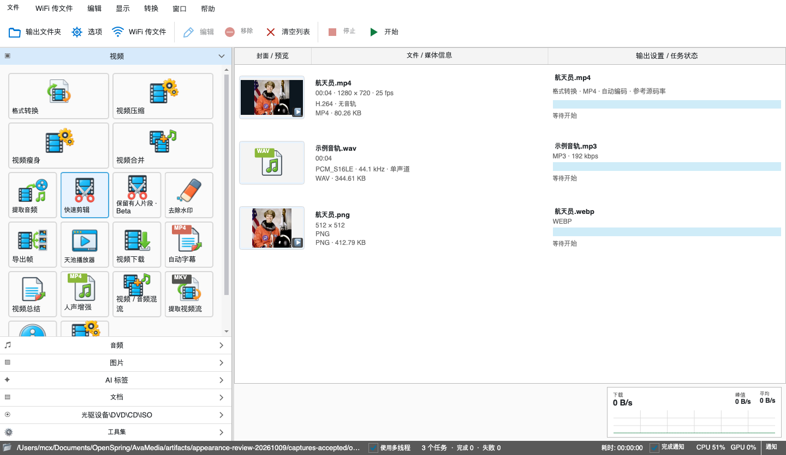
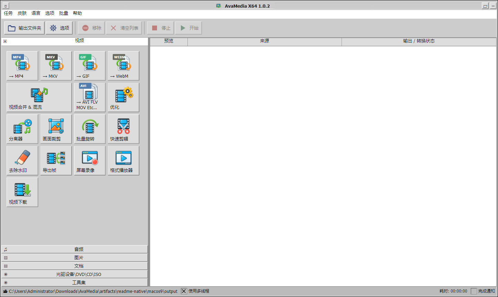
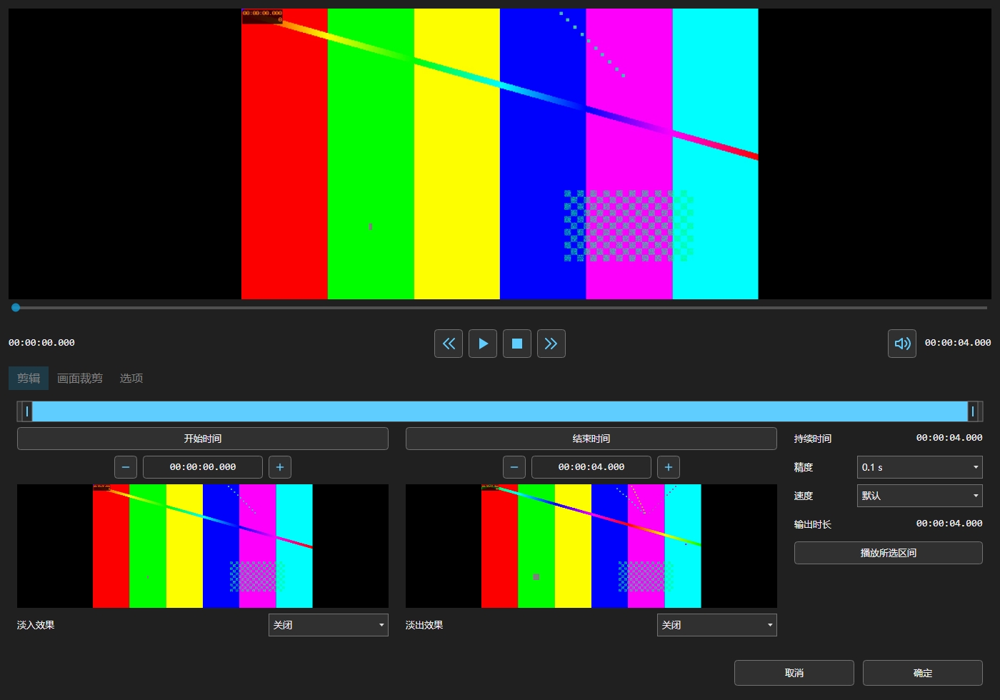
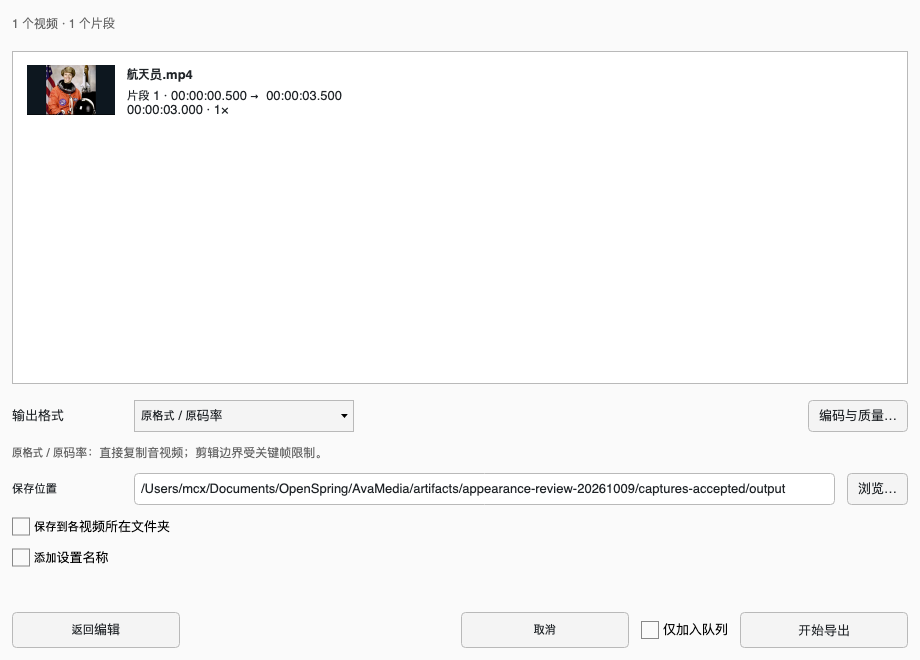
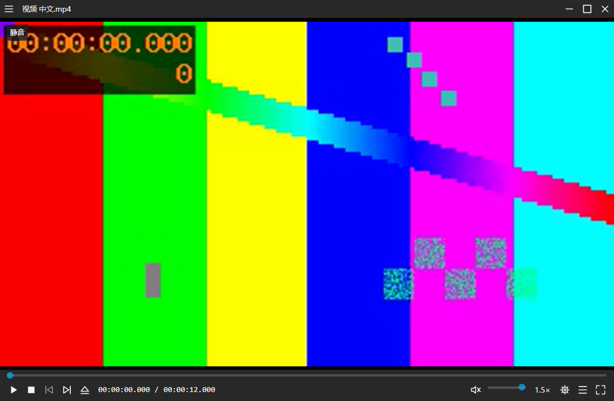
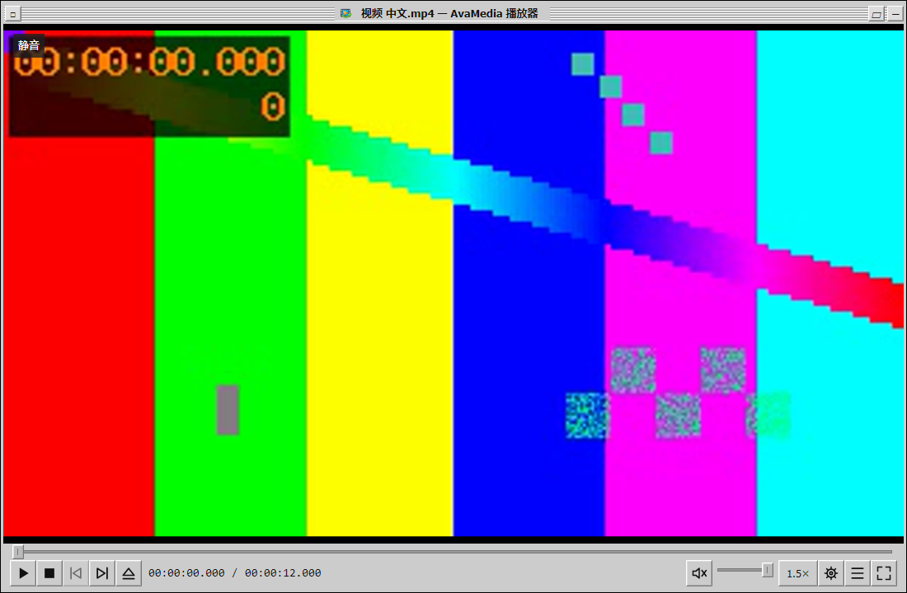

# 天池万象转换 · AvaMedia

[](https://github.com/mcxen/AvaMedia/actions/workflows/ci.yml)
[](https://github.com/mcxen/AvaMedia/actions/workflows/release.yml)
[](LICENSE)

**天池万象转换（AvaMedia）** 使用 **Avalonia 11.3.22、C# 和 .NET 8** 开发，是支持 Windows 与 macOS 的开源桌面多媒体客户端。经典布局和编辑流程参考 FormatFactory X64 5.10.0；代码、控件和图标独立实现，采用 AGPL-3.0-only。

## 下载与安装

从 [GitHub Releases](https://github.com/mcxen/AvaMedia/releases/latest) 下载对应平台的成品。客户端包含 .NET 运行时，无需单独安装 SDK。

| 平台 | 安装包 | 便携包 |
| --- | --- | --- |
| Windows x64 | `AvaMedia-版本-win-x64-setup.exe`，每用户安装、快捷方式与卸载 | `AvaMedia-版本-win-x64.zip` |
| macOS Apple Silicon | `AvaMedia-版本-osx-arm64.pkg` / `.dmg` | `AvaMedia-版本-osx-arm64.zip` |

后续 macOS 发布仅提供 Apple Silicon（ARM64）版本。

客户端、Windows 快捷方式和 macOS 应用使用中文名“天池万象转换”；macOS 应用文件名为 `天池万象转换.app`。GitHub 仓库、可执行文件和发布压缩包继续使用 AvaMedia。品牌配置统一维护在 [`Branding.props`](Branding.props)。

Release 同时提供源码 ZIP 和 `SHA256SUMS.txt`。macOS 包采用 ad-hoc 签名，尚未经过 Developer ID 签名和公证；初次启动可能需要在系统隐私与安全性中允许打开。

新构建包含 yt-dlp 和 YouTube 解析所需 QuickJS-NG，无需安装 Python。FFmpeg / FFprobe 是独立媒体引擎；Windows 安装后可从开始菜单运行 **Install media tools**，或在程序目录执行：

```powershell
powershell -NoProfile -ExecutionPolicy Bypass -File scripts/Install-MediaTools.ps1 -Destination tools
```

Windows 工具安装采用共享 DLL 构建，ffmpeg 与 ffprobe 共用媒体库，仅安装所需运行文件并清理下载缓存。当前运行文件约 153.71 MiB，比原静态程序组合减少 41.7%；与格式工厂的实测比较及验证见 [FFmpeg 体积说明](docs/FFMPEG-SIZE.md)。

macOS 使用 `bash scripts/Install-MediaTools-macOS.sh` 安装定制 ARM64 FFmpeg，核对下载清单并清理临时文件；应用已包含下载工具。定制引擎按现有功能配置依赖，作为独立运行包提供对应源码，构建与原生验证说明见 [macOS FFmpeg](docs/FFMPEG-MACOS.md)。也可在“选项 → 外部工具”指定路径，或设置 `AVAMEDIA_FFMPEG`、`AVAMEDIA_FFPROBE`、`AVAMEDIA_YT-DLP`。详见 [平台与工具配置](docs/PLATFORMS.md)。

## 界面

以下截图来自实际客户端，示例媒体为测试生成的画面。

**经典主窗口 · Light**



**Mac OS 9 · Platinum**



**媒体编辑器 · Dark**



**编辑完成后的导出设置**



三套皮肤共用组件角色和布局指标。时间统一显示三位小数，底层保留精确帧时间；播放、微调、确认与取消控件保持一致尺寸和对齐。规范见 [UISPEC.MD](UISPEC.MD)，皮肤说明见 [Mac OS 9 设计](docs/MACOS9-SKIN.md)。

## 功能

- **中英文界面**：“语言 / Language”菜单提供简体中文、English 和跟随系统，实时切换并保存偏好；浅色、深色和 Mac OS 9 皮肤共用语言资源。
- **媒体转换**：音视频、图片及其他容器；尺寸、编码、质量、帧率、采样率、声道和预设可配置。
- **旧视频格式**：3GP / 3G2、RM / RMVB、AVI / DivX、WMV / ASF、FLV / F4V、旧 QuickTime、VCD / DVD、DV、AMV、NSV 等可导入播放器、剪辑与压缩；转换窗口提供 3GP / 3G2 输出，默认 MPEG-4 + AAC。见 [旧视频支持](docs/LEGACY-VIDEO.md)。
- **拖入即选工具**：视频、图片、音频与文档自动分类，左侧真实缩略图，右侧工具卡片与流动连线；混合批次注明接收 / 跳过数量，点击直接带入编辑。见 [文件路由](docs/MEDIA-ROUTING.md)。
- **WiFi 传文件**：顶部开启局域网收发，手机扫码通过网页上传照片、MOV 视频及文件，接收后导入转换或高画质压缩；电脑也可分享文件给手机下载。见 [WiFi 传文件](docs/WIFI-TRANSFER.md)。
- **视频压缩**：自动画质档、手动质量 / 码率与目标体积；支持苹果 MOV / M4V / MP4、HEVC 和 ProRes 输入，iPhone HLG / Dolby Vision 转 SDR，输出 MP4 / MOV / M4V / MKV。见 [视频压缩](docs/VIDEO-COMPRESSION.md)。
- **快速剪辑**：选择视频直接编辑，多文件、多片段、按段数 / 时长 / 时间点分割，最后统一配置导出，每个片段分别输出。
- **预览与编辑**：实际帧定位、区间播放、结束边界帧、选区移动 / 缩放、比例锁定、键盘微调、旋转、镜像、速度和淡入淡出。
- **批量裁剪与旋转**：共享像素或比例选区，逐文件调整，本地人脸方向识别，对照原画面和处理后预览。
- **图片压缩**：支持苹果 HEIC / HEIF 输入，导出 JPEG / WebP / PNG；批量勾选、质量方案与尺寸上限，滑动 / 并排对比、1:1 像素查看，显示真实体积，仅保存实际变小的结果并保留原图。macOS 使用 ImageIO 生成方向正确的缩略图，调整压缩参数复用原图预览。见 [图片压缩](docs/IMAGE-COMPRESSION.md) 与 [HEIC 支持](docs/HEIC.md)。
- **合并、混流与字幕**：逐输入保留编辑参数，支持视频 / 音轨选择、字幕烧录与独立字幕轨配置。
- **视频下载**：分享文本与批量链接解析、YouTube 播放列表 / B站分P、多画质、视频 / 音频、字幕、登录态与代理；内置 yt-dlp 和 QuickJS-NG，停止后可重试续传。平台要求与验证见 [视频下载](docs/VIDEO-DOWNLOAD.md)。
- **任务与工具**：并行队列、停止、重试、日志、拖放、恢复和导入导出；PDF、归档、导出帧与下载入口。
- **天池播放器**：独立窗口、PotPlayer 常用键位、后台目录播放列表；Windows 新安装器提供独立开始菜单入口并注册视频 / 音频“打开方式”，便携版可在选项的系统页注册。见 [播放器](docs/PLAYER.md)。
- **高级设置**：[自动 GPU 转码](docs/GPU-TRANSCODING.md)，适配 Apple M 系列、NVIDIA RTX、Intel 核显 / Arc、AMD，自动匹配编码与解码路径并分级回退；另提供线程、图片质量、减少动效和外部工具配置。

使用流程：选择功能 → 添加媒体 → 配置或编辑 → 加入队列 → 开始。快速剪辑返回编辑保留草稿，取消不加入任务；Fast Copy 受关键帧限制，包含滤镜时需重新编码。水印区域采用模糊处理，PDF → Office 提取文本。详见 [功能与验证](docs/FEATURES.md)。

专项说明：[快速剪辑](docs/QUICK-CLIP.md) · [视频编辑](docs/VIDEO-EDITING.md) · [批量裁剪](docs/BATCH-CROP.md) · [批量旋转](docs/BATCH-ROTATE.md) · [字幕与选轨](docs/SUBTITLE-OPTIONS.md) · [高级设置](docs/SETTINGS.md)。

播放器大文件测量包括真实 5.23 GB 4K 视频、1080p60 与两小时 PCM 音频，并记录启动、CPU、分配、定位及 UI 调度；测试方法与本机前后数据见 [性能记录](docs/PLAYER-PERFORMANCE.md)。

## 接口与架构

`AvaMedia.Core` 不依赖 Avalonia，负责模型、校验、任务计划和媒体处理；`AvaMedia.Desktop` 负责窗口、主题、预览呈现与平台音频。

图片压缩通过 `IImageCompressor` 提供探测和真实编码，窗口预览与队列输出共用 `FfmpegImageCompressor`。

业务窗口依赖 `IMediaEngine`，队列仅依赖 `IJobExecutor`。预览、方向识别和音频输出分别使用 `IMediaPreview`、`IVideoOrientationDetector` 和 `IAudioOutput`。接口已接入生产调用方并支持测试替换；具体依赖和实现边界见 [ARCHITECTURE](docs/ARCHITECTURE.md)。

## 从源码运行

```sh
git clone https://github.com/mcxen/AvaMedia.git
cd AvaMedia
dotnet restore AvaMedia.sln
dotnet build AvaMedia.sln -c Release
dotnet run --project src/AvaMedia.Desktop -c Release
```

需要 .NET 8 SDK 和外部媒体工具。Windows 可双击 `Start-AvaMedia.cmd`，使用工程内 SDK 或已有 SDK。

```powershell
pwsh -File scripts/Verify.ps1
pwsh -File scripts/Publish.ps1 -Runtime win-x64 -Version 1.0.5
pwsh -File scripts/Package-Windows.ps1 -Version 1.0.5
```

验证覆盖真实输出、剪辑、字幕、批量处理、方向识别、交互、三套皮肤、设置、接口替换与消融。测试自行生成媒体，不需要用户视频。录制权限和音频设备按实际系统配置工作；macOS 用户设备媒体能力需结合设备验收。

开发者可用 `AvaMedia.Desktop --capture <目录> --editor <视频> --verify-ui` 捕获实际界面并验证解码，`--quick-clip <视频>` 捕获编辑器和导出页，`--dark` / `--macos9` 切换皮肤。图标资产和提示词保存在 `Assets`，同系列维护见 [$avamedia-icons](.agents/skills/avamedia-icons/SKILL.md)。

“皮肤 → Mac OS 9 · Platinum” 使用独立生成的 20 款透明功能图标，覆盖全部 54 个功能入口，并在已打开窗口和新子窗口中随皮肤切换。素材、完整提示词和哈希保存在 [`Assets/FeatureIcons/macos9`](src/AvaMedia.Desktop/Assets/FeatureIcons/macos9/README.md)；浅色、深色皮肤继续使用 v2 系列。[$avamedia-icons](.agents/skills/avamedia-icons/SKILL.md) 支持维护这两套风格。

## 自动发布

推送 `vMAJOR.MINOR.PATCH` tag 后，[Release 工作流](.github/workflows/release.yml) 自动验证、构建安装包、生成源码与校验清单并上传 GitHub Release。Windows 验证安装、原生启动和卸载；Mac ARM64 包在 Apple Silicon runner 构建并验证启动。

```sh
git tag -a v1.0.5 -m "AvaMedia 1.0.5"
git push origin v1.0.5
```

流程见 [RELEASE](docs/RELEASE.md)，Git 管理见 [GIT-WORKFLOW](docs/GIT-WORKFLOW.md)，18 组媒体消融见 [ABLATION](docs/ABLATION.md)。

## 许可证

版权所有 © 2026 AvaMedia contributors。原创代码、测试、文档和原创图标采用 **AGPL-3.0-only**；见 [LICENSE](LICENSE) 与 [COPYRIGHT](COPYRIGHT)。依赖、方向模型和安装器声明见 [THIRD-PARTY-NOTICES](THIRD-PARTY-NOTICES.md)、`licenses/` 及资产说明。

未导入 FormatFactory 的专有 DLL、图标或品牌素材。FFmpeg 许可取决于实际构建；客户端通过独立进程调用，成品不附带这些外部工具。技术与协议调研见 [RESEARCH](docs/RESEARCH.md)。

## 视频播放器

独立播放器采用 PotPlayer 布局和常用快捷键，支持连续播放、全屏、倍速、音量、选轨与逐帧定位。视频与声音流式解码，暂停复用会话；Windows 发布使用 ReadyToRun。操作与冷启动测量见 [播放器说明](docs/PLAYER.md)。




