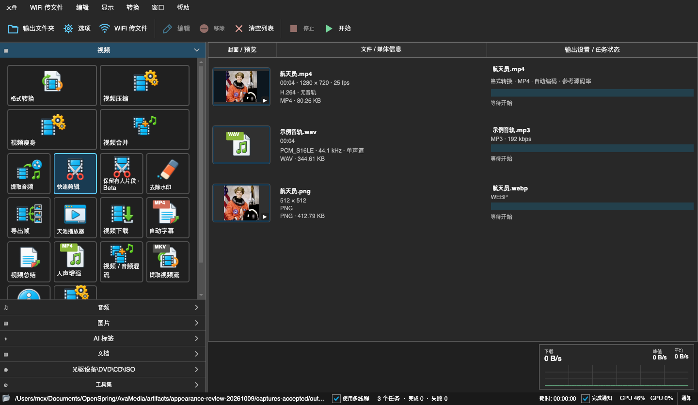
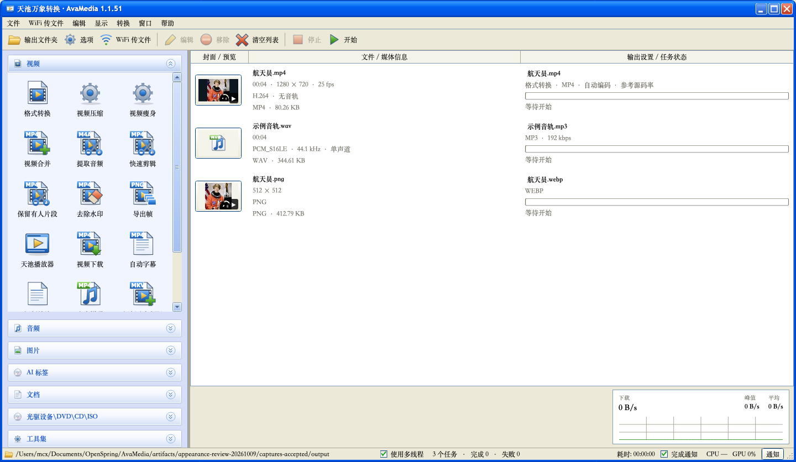
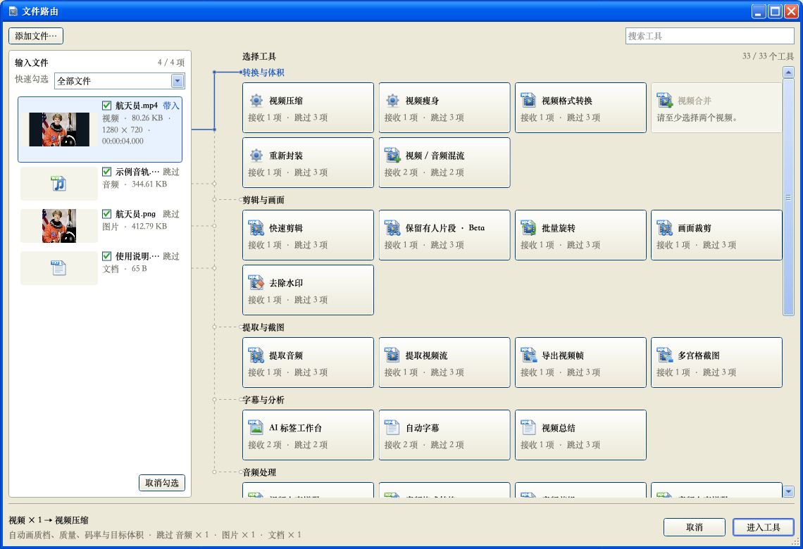
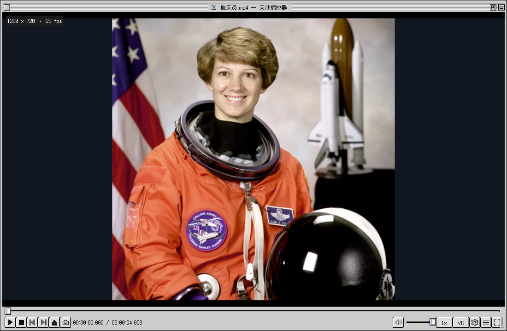

# 天池万象转换 · AvaMedia

**简体中文** · [English](README.en.md)

[](https://github.com/mcxen/AvaMedia/actions/workflows/ci.yml)
[](https://github.com/mcxen/AvaMedia/actions/workflows/release.yml)
[](LICENSE)

面向 **Windows 和 macOS** 的开源桌面媒体工具。转换、压缩、剪辑、播放、下载，以及图片和 PDF 处理，集中在一个可批量执行的任务队列中。

使用 **C#、.NET 8 和 Avalonia 11** 开发，提供简体中文 / English 界面与 Light、Dark、Mac OS 9 · Platinum 与 Windows XP · Luna 四套皮肤。当前仍为开发版，功能范围和已验证结果见 [功能说明](docs/FEATURES.md)。

[下载](https://github.com/mcxen/AvaMedia/releases/latest) · [界面截图](#界面截图) · [从源码运行](#从源码运行) · [报告问题](https://github.com/mcxen/AvaMedia/issues)

## 下载与安装

从 [GitHub Releases](https://github.com/mcxen/AvaMedia/releases/latest) 下载对应平台的安装包。

| 平台 | 文件 | 安装方式 |
| --- | --- | --- |
| Windows x64 | `AvaMedia-<版本>-win-x64-setup.exe` | 运行安装器，包含快捷方式与卸载入口 |
| Windows x64 便携版 | `AvaMedia-<版本>-win-x64-portable.zip` | 解压后运行 `AvaMedia.Desktop.exe` |
| macOS Apple Silicon | `AvaMedia-<版本>-osx-arm64.dmg` | 打开后将 `天池万象转换.app` 拖入 Applications |

macOS 安装包面向 **Apple Silicon（ARM64），声明最低 macOS 13.4**；该最低版本的完整设备验收状态见 [平台说明](docs/PLATFORMS.md)。应用采用 ad-hoc 签名，尚未进行 Developer ID 签名和公证，首次启动可能需要在系统“隐私与安全性”中允许打开。

新构建内置 **FFmpeg / FFprobe、yt-dlp 和 QuickJS-NG**。首次启动若缺少 .NET 8，点击“安装运行时”即可下载、校验并安装所需的 .NET 与 ASP.NET Core，完成后自动进入软件；已有完整运行时则直接启动。安装或首次配置成功后保存运行时位置，后续直接加载进入软件，不再重复预检。运行时安装在当前用户目录，无需管理员权限，也无需安装 SDK 或 Python。各版本 SHA256 与对应媒体工具源码归档链接位于 Release 说明中。

当前开发构建首次正常启动时会在后台下载并校验 LaMa 模型，其他功能可继续使用；缓存有效时不重复下载。LaMa 修复推理和编辑入口尚未接入，见 [模型安装](docs/MODEL-INSTALLATION.md)。

## 主要功能

| 功能 | 支持内容 |
| --- | --- |
| 视频转换与压缩 | MP4、MKV、WebM、AVI、MOV、TS 等；画质、码率或目标体积；Apple、NVIDIA、Intel、AMD 硬件转码与软件回退；iPhone HDR 转 SDR |
| 剪辑与批量处理 | 多文件、多片段、按段数 / 时长 / 时间点分割；裁剪、旋转、镜像、速度、淡入淡出；批量裁剪、方向建议、重命名与多宫格截图 |
| 音轨与字幕 | 合并、混流、音视频流提取；选轨、多音轨保留、采样率、声道、音量与音频效果；字幕烧录或独立字幕轨 |
| 图片转换与压缩 | HEIC / HEIF 输入；JPEG、WebP、PNG 压缩；实际编码后的体积与前后对比；只保存变小的压缩结果并保留原图；另有图片格式转换、缩放与旋转 |
| PDF 工作区 | 页面预览、选页、排序、旋转、拆分与合并；图片 / TXT 排版为 PDF；PDF 做旧、压缩及文本提取 |
| 视频下载 | 内嵌浏览器嗅探、分享文本、批量链接、播放列表 / 分 P / 相册；画质、视频 / 音频、字幕、登录态、代理与失败重试 |
| 天池播放器 | 独立播放窗口、目录播放列表、全屏、倍速、选轨、逐帧定位、当前帧截图与常用 PotPlayer 式快捷键 |
| WiFi 传文件 | 同一局域网内，手机扫码通过浏览器上传文件，电脑也可分享文件给手机下载 |
| 任务队列与工具 | 并行处理、进度、停止、编辑参数、重试、日志、自动保存与导入导出；ZIP 压缩 / 解压、导出帧、DVD / VOB 转换和原始数据复制为 ISO |

拖入文件后，路由按文件类型显示匹配工具、可带入与跳过数量，并支持搜索和键盘选择；也可先选择功能，再添加文件、调整参数、加入队列并开始处理。快速剪辑先编辑片段，再统一配置导出，每个片段生成独立文件。

### 使用边界

- **Fast Copy** 的剪辑起点受关键帧限制；裁剪、画面旋转等滤镜需要重新编码。
- **HEIC / HEIF** 压缩只处理静态主图，输出 JPEG / WebP / PNG，不保留 Live Photo 视频、深度图或 HDR 增益图。
- **PDF → DOCX / XLSX** 提取文本，不重建原始排版；PDF 做旧和整页压缩会栅格化页面。
- **去除水印** 使用选区周围像素进行插值修复，不能还原被遮挡的真实内容；重新封装也不保证修复损坏媒体。
- 下载可用性取决于站点、账号、地区和网络限制，详见 [视频下载](docs/VIDEO-DOWNLOAD.md)。

## 界面截图

以下为 2026-10-09 在 macOS 上运行本地 Release 开发构建后生成的中文界面截图。四套皮肤共用功能和参数；示例画面来自 [NASA 公共领域照片](tests/AvaMedia.BatchRotateTests/Fixtures/README.md)。

| Light | Dark |
| --- | --- |
| [](docs/assets/screenshots/main-light.png) | [](docs/assets/screenshots/main-dark.png) |
| **Mac OS 9 · Platinum** | **Windows XP · Luna** |
| [](docs/assets/screenshots/main-macos9.png) | [](docs/assets/screenshots/main-winxp.png) |
| **文件路由 · Windows XP** | **快速剪辑 · Dark** |
| [](docs/assets/screenshots/route-winxp.png) | [](docs/assets/screenshots/editor-dark.png) |
| **播放器 · Platinum** | **视频下载 · Light** |
| [](docs/assets/screenshots/player-macos9.png) | [](docs/assets/screenshots/download-light.png) |

点击配图查看原图。[完整截图目录](docs/assets/screenshots/README.md) 收录四套皮肤的 44 张截图，包含路由、设置、转换、编辑、导出、播放及组件预览；检查范围与修正记录见 [外观检查](docs/APPEARANCE-REVIEW.md)。

## 从源码运行

需要 [.NET 8 SDK](https://dotnet.microsoft.com/download/dotnet/8.0)，版本选择见 [`global.json`](global.json)。

```sh
git clone https://github.com/mcxen/AvaMedia.git
cd AvaMedia
dotnet build src/AvaMedia.Desktop/AvaMedia.Desktop.csproj -c Release
dotnet run --project src/AvaMedia.Desktop -c Release --no-build
```

源码运行需准备 FFmpeg / FFprobe；下载功能另需 yt-dlp 和 QuickJS-NG。可使用 Release 说明链接的媒体工具包。未内置工具的开发构建可在“选项 → 外部工具”配置路径，或使用 `AVAMEDIA_FFMPEG`、`AVAMEDIA_FFPROBE`、`AVAMEDIA_YT-DLP` 环境变量；工具查找也支持项目 `.tools`、PATH 和 macOS Homebrew 路径。正式安装包优先使用内置引擎。

日常源码修改只构建受影响项目并完成必要静态检查；仅修改文档或资源时不运行构建和测试。功能回归按明确要求执行，范围遵循 [`AGENTS.md`](AGENTS.md)。

### 代码结构

| 路径 | 职责 |
| --- | --- |
| [`src/AvaMedia.Core`](src/AvaMedia.Core) | 媒体模型、参数校验、任务计划、队列与媒体处理，不依赖 Avalonia |
| [`src/AvaMedia.Desktop`](src/AvaMedia.Desktop) | 桌面窗口、语言、皮肤、预览、播放与平台集成 |
| [`website`](website) | 中英文宣传落地页、功能与界面展示；运行与构建见 [网页说明](website/README.md) |
| [`scripts`](scripts) / [`.github/workflows`](.github/workflows) | 媒体引擎准备、构建、打包与发布 |
| [`tests`](tests) | 专项验证程序与测试素材 |

接口边界见 [架构说明](docs/ARCHITECTURE.md)，品牌配置见 [`Branding.props`](Branding.props)，界面规范见 [`UISPEC.MD`](UISPEC.MD)。

## 文档与贡献

| 主题 | 文档 |
| --- | --- |
| 转换与压缩 | [视频压缩](docs/VIDEO-COMPRESSION.md) · [图片压缩](docs/IMAGE-COMPRESSION.md) · [HEIC](docs/HEIC.md) · [TS 视频](docs/TS-VIDEO.md) · [GPU 转码](docs/GPU-TRANSCODING.md) |
| 编辑与播放 | [快速剪辑](docs/QUICK-CLIP.md) · [视频编辑](docs/VIDEO-EDITING.md) · [批量裁剪](docs/BATCH-CROP.md) · [批量旋转](docs/BATCH-ROTATE.md) · [字幕与选轨](docs/SUBTITLE-OPTIONS.md) · [播放器](docs/PLAYER.md) |
| 文件与工具 | [文件路由](docs/MEDIA-ROUTING.md) · [WiFi 传文件](docs/WIFI-TRANSFER.md) · [PDF 工作区](docs/PDF-WORKSPACE.md) · [视频下载](docs/VIDEO-DOWNLOAD.md) · [批量工具](docs/BATCH-TOOLS.md) |
| 开发与发布 | [架构](docs/ARCHITECTURE.md) · [设置](docs/SETTINGS.md) · [Mac OS 9](docs/MACOS9-SKIN.md) · [Windows XP](docs/WINDOWS-XP-SKIN.md) · [平台](docs/PLATFORMS.md) · [Git 工作流](docs/GIT-WORKFLOW.md) · [自动发布](docs/RELEASE.md) |

欢迎通过 [Issues](https://github.com/mcxen/AvaMedia/issues) 报告问题或提出建议。媒体相关问题请附系统版本、应用版本、输入格式、操作步骤和错误日志。

发布由 `vMAJOR.MINOR.PATCH` tag 触发。日常提交照常推送；相对上次已发布 tag 的有效代码变更累计达到 **1200 行**且相关本地检查通过后，才创建新版本 tag。文档、许可证、资源和生成文件不计入，已发布 tag 保持不变。具体流程见 [Git 工作流](docs/GIT-WORKFLOW.md)。

## 许可证

版权所有 © 2026 AvaMedia contributors。原创代码、测试、文档和原创图标采用 **AGPL-3.0-only**，见 [LICENSE](LICENSE) 与 [COPYRIGHT](COPYRIGHT)。第三方依赖、模型及安装器声明见 [THIRD-PARTY-NOTICES](THIRD-PARTY-NOTICES.md) 和 [`licenses`](licenses)。

经典转换布局与编辑流程参考 FormatFactory，播放器操作参考 PotPlayer；代码、控件和图标独立实现，未导入其专有 DLL、图标或品牌素材。内置 FFmpeg 通过独立进程调用，包含 x264 / x265，采用 GPL-3.0-or-later；精确对应的源码和构建配方通过 Release 说明链接的媒体归档提供。
